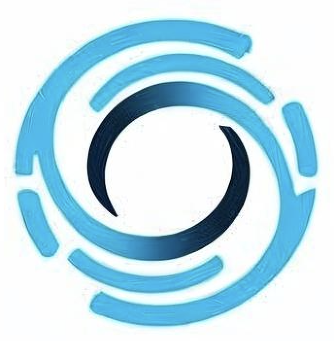

# 🎨 Design Visual da Landing Page Orbit PRO

## ✅ Elementos Visuais Implementados

### 1. **Hero Section** - `orbitPro.jpg`

- **Localização:** Seção principal (Hero)
- **Posição:** Lado direito do conteúdo principal
- **Características:**
  - Animação flutuante (`float` animation)
  - Bordas arredondadas (`border-radius: 1rem`)
  - Sombra azul temática com a cor da marca
  - Responsive em todos os dispositivos
  - Loading eager (carregamento prioritário)

### 2. **About Section** - Design Visual Personalizado

- **Localização:** Seção "Sobre a Orbit PRO"
- **Posição:** Lado direito da descrição da empresa
- **Características:**
  - **Design circular animado** com as cores da marca
  - **Elementos flutuantes** com animações suaves
  - **Grid tecnológico** com indicadores (AI, IA, PRO, 20+)
  - **Logo Orbit PRO** integrado no design
  - **Rotação contínua** do elemento principal
  - **Responsive design** adaptável

## 🎨 Design Visual Personalizado (About Section)

### Estrutura do Design:

```html
<div class="about__visual">
  <div class="about__design">
    <div class="design__circle design__circle--1"></div>
    <div class="design__circle design__circle--2"></div>
    <div class="design__circle design__circle--3"></div>
    <div class="design__tech-grid">
      <div class="tech__item">AI</div>
      <div class="tech__item">IA</div>
      <div class="tech__item">PRO</div>
      <div class="tech__item">20+</div>
    </div>
    <div class="design__orbit-text">
      <span class="orbit__text">Orbit</span>
      <span class="orbit__pro">PRO</span>
    </div>
  </div>
</div>
```

### Estilização Principal:

````css
```css
/* Design Circular Animado */
.about__design {
  background: linear-gradient(135deg, #00bfff 0%, #0099cc 100%);
  border-radius: 50%;
  box-shadow: 0 8px 30px rgba(0, 191, 255, 0.3);
  animation: rotateOrbit 20s linear infinite;
}

/* Círculos Flutuantes */
.design__circle--1 {
  background-color: #ffffff;
  animation: float 4s ease-in-out infinite;
}

/* Grid Tecnológico */
.design__tech-grid {
  display: grid;
  grid-template-columns: 1fr 1fr;
  gap: 5px;
}

.tech__item {
  background-color: rgba(255, 255, 255, 0.9);
  color: #333333;
  animation: pulse 3s ease-in-out infinite;
}

/* Logo Integrado */
.orbit__text {
  color: #333333;
  font-weight: 600;
}

.orbit__pro {
  color: #00bfff;
  font-weight: 700;
}
````

## 🎯 **Características do Design Visual:**

### Cores da Marca Utilizadas:

- **Primary:** `#00BFFF` (Ciano) - Gradiente principal e texto PRO
- **Secondary:** `#333333` (Cinza Escuro) - Texto e elementos
- **Background:** `#FFFFFF` (Branco) - Círculos e cards internos
- **Accent:** `#0099CC` (Azul escuro) - Gradiente secundário

### Animações Implementadas:

1. **Rotação Contínua:** 20s de rotação completa do círculo principal
2. **Float Effect:** Círculos flutuantes com diferentes tempos (4s, 5s, 6s)
3. **Pulse Effect:** Cards tecnológicos com efeito de pulsação (3s)
4. **Hover States:** Mantidos em outros elementos da página

### Elementos Informativos:

- **"AI"** - Inteligência Artificial
- **"IA"** - Inteligência Artificial (PT)
- **"PRO"** - Nível profissional
- **"20+"** - Mais de 20 anos de experiência

## 📱 Responsividade

### Tamanhos por Dispositivo:

- **Mobile (≤350px):** 180px × 180px
- **Small devices:** 220px × 220px
- **Tablets (768px+):** 250px × 250px
- **Desktop (1024px+):** 300px × 300px

### Adaptações Responsivas:

- **Textos escaláveis** conforme o tamanho
- **Elementos internos proporcionais**
- **Animações mantidas** em todos os dispositivos

## ⚡ Vantagens do Design Personalizado

### Performance:

- ✅ **Sem dependência de imagens** externas
- ✅ **CSS puro** - carregamento mais rápido
- ✅ **Animações CSS** otimizadas
- ✅ **Escalabilidade infinita** sem perda de qualidade

### Branding:

- ✅ **Cores da marca** integradas
- ✅ **Logo Orbit PRO** destacado
- ✅ **Elementos informativos** relevantes
- ✅ **Design único** e memorável

### Experiência do Usuário:

- ✅ **Movimento atrativo** que chama atenção
- ✅ **Informações visuais** sobre a empresa
- ✅ **Consistência visual** com o resto da página
- ✅ **Acessibilidade** mantida

## 🔄 Antes vs Depois

### Antes:

- Imagem PNG estática (`orbit.png`)
- Elemento passivo sem interação
- Dependência de arquivo externo

### Depois:

- **Design visual animado** com CSS puro
- **Elementos informativos** integrados
- **Animações suaves** e profissionais
- **Performance otimizada** sem dependências externas
- **Branding reforçado** com cores e logo da marca

---

**🎨 O novo design visual:**

- Reforça a identidade da Orbit PRO
- Comunica experiência e tecnologia
- Mantém performance otimizada
- Cria uma experiência única e memorável

````

## 📱 Responsividade

### Tamanhos por Dispositivo:

- **Mobile (≤350px):** 180px
- **Small devices:** 220px (about) / 250px (hero)
- **Tablets (768px+):** 250px (about) / 300px (hero)
- **Desktop (1024px+):** 300px (about) / 350px (hero)

## ⚡ Otimizações de Performance

### Lazy Loading

```html
<!-- Hero (carregamento prioritário) -->


<!-- About (carregamento otimizado) -->

````

### Características Técnicas:

- **Aspect Ratio:** Proporção fixa para evitar layout shift
- **Object-fit:** Cover para melhor enquadramento
- **Max-height:** Limites para controle de tamanho
- **Alt text:** Descrições acessíveis

## 🎯 Integração com o Design System

### Consistência Visual:

- ✅ Cores da marca mantidas (sombras azuis `#00BFFF`)
- ✅ Border-radius consistente (1rem)
- ✅ Transições suaves (0.3s)
- ✅ Hierarquia visual respeitada
- ✅ Animações harmoniosas

### Acessibilidade:

- ✅ Alt texts descritivos
- ✅ Contraste adequado
- ✅ Foco keyboard-friendly
- ✅ Hover states claros

## 🔄 Antes vs Depois

### Antes:

- SVGs abstratos gerados por código
- Formas geométricas sem contexto
- Design mais genérico

### Depois:

- Imagens reais da marca Orbit PRO
- Identidade visual mais forte
- Conexão emocional com o usuário
- Profissionalismo aumentado

---

**🎨 As imagens foram integradas mantendo:**

- Performance otimizada
- Design responsivo
- Acessibilidade
- Consistência visual
- Experiência do usuário aprimorada
